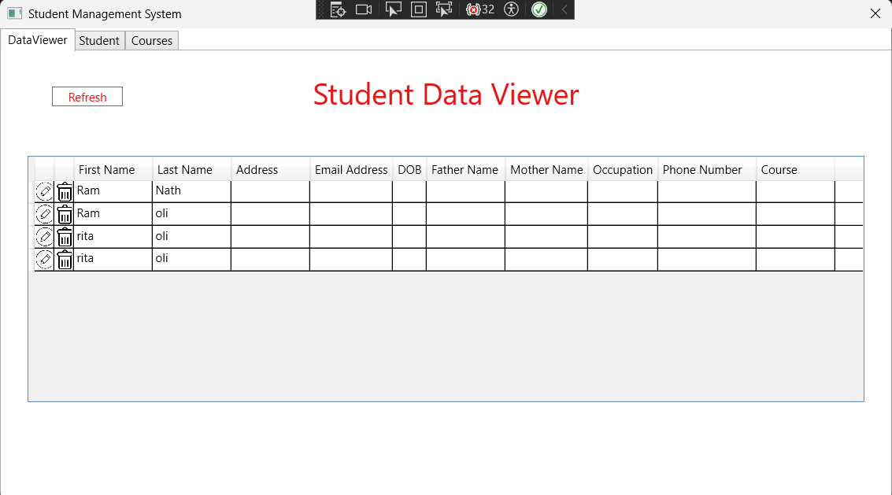
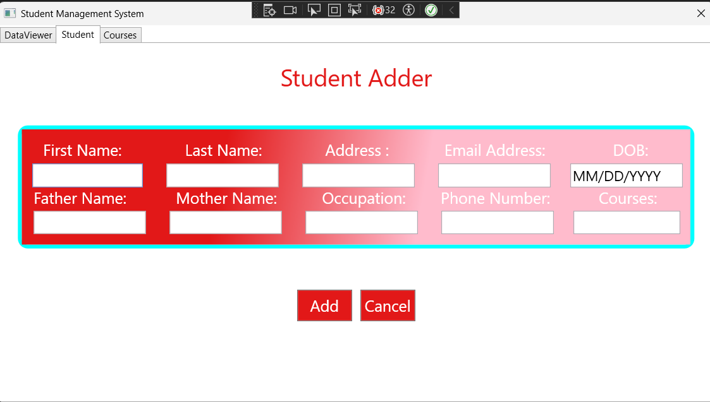
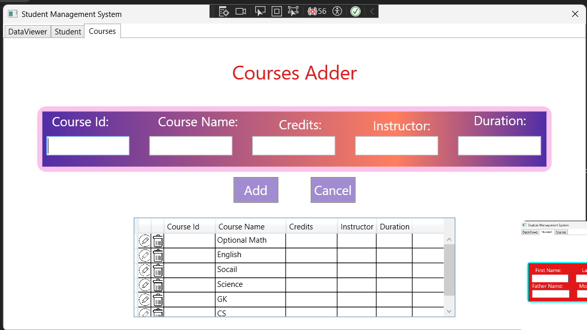

# 🎓 Student Management System (WPF Desktop Application)

A clean, user-friendly **WPF desktop application** for managing **students and courses**, built using **C#, WPF, and SQL Server**.  
This project demonstrates solid understanding of **CRUD operations**, **data validation**, and **desktop UI design**.

> 💡 Ideal for showcasing desktop application development, database integration, and C# fundamentals.

---

## 📸 Application UI Preview

### 📋 Student Data Viewer
Displays all student records with edit & delete actions.



---

### ➕ Student Adder Form
Add new students with validated input fields.



---

### 📚 Courses Management
Manage courses with full CRUD functionality.



---

## 🚀 Key Features

### 👨‍🎓 Student Management
- Add new student records  
- View students in a DataGrid  
- Edit & delete existing records  
- Assign courses to students  
- Real-time input validation  

### 📘 Course Management
- Add new courses  
- View all courses  
- Edit & delete courses  
- Assign instructors and credits  

### ✔️ Validation Rules
- Name validation (letters only)  
- Email format validation  
- Phone number validation (10 digits)  
- Date of Birth format (MM/DD/YYYY)  
- Address & occupation validation  

---

## 🛠️ Technology Stack

| Layer | Technology |
|------|-----------|
| UI | WPF (XAML) |
| Language | C# |
| Framework | .NET Framework |
| Database | SQL Server |
| Data Access | ADO.NET |
| IDE | Visual Studio |

---

## 🏗️ Project Structure

```text
StudentManagementSystem/
├── MainWindow.xaml
├── MainWindow.xaml.cs
├── App.xaml
├── App.config
├── StudentManagementDataSet.xsd
├── Images/
│   ├── edit_image.png
│   └── delete_image.png
├── screenshots/
│   ├── student-data-viewer.png
│   ├── student-adder.png
│   └── courses-adder.png
└── Properties/
📊 Database Schema
Students Table
CREATE TABLE Students (
    Id INT PRIMARY KEY IDENTITY(1,1),
    FirstName NVARCHAR(100),
    LastName NVARCHAR(100),
    Address NVARCHAR(255),
    EmailAddress NVARCHAR(255),
    DOB DATE,
    FatherName NVARCHAR(100),
    MotherName NVARCHAR(100),
    Occupation NVARCHAR(100),
    PhoneNumber NVARCHAR(15),
    Courses NVARCHAR(255)
);

Courses Table
CREATE TABLE Courses (
    Id INT PRIMARY KEY IDENTITY(1,1),
    CourseId NVARCHAR(50),
    Name NVARCHAR(100),
    Credit INT,
    Instructor NVARCHAR(100),
    Duration NVARCHAR(50)
);

⚙️ Installation & Setup
Prerequisites
Windows 7+
.NET Framework 4.5+
SQL Server
Visual Studio 2017+

Steps
git clone <https://github.com/pawan-pathak12/StudentMgmtApp_WPF.git>


Create database: StudentManagement

Run SQL scripts

Update connection string in App.config

Build & Run (F5)

🔍 Code Highlights
Database Connection
private void mycon()
{
    string connectionString = ConfigurationManager
        .ConnectionStrings["StudentManagementSystem.Properties.Settings.StudentManagementConnectionString"]
        .ConnectionString;

    connection = new SqlConnection(connectionString);
    connection.Open();
}

Load Student Data
public void GetStudentData()
{
    string query = "SELECT * FROM Students";
    SqlCommand cmd = new SqlCommand(query, connection);
    SqlDataAdapter adapter = new SqlDataAdapter(cmd);
    DataTable table = new DataTable();
    adapter.Fill(table);
    DataViewerList.ItemsSource = table.DefaultView;
}

⚠️ Known Limitations
MVVM pattern not implemented
Fixed window size
Basic error handling
Course edit/delete partially implemented

🚀 Future Improvements

MVVM architecture
Entity Framework integration
Search & filter
Export to Excel / PDF
Authentication & authorization
Reporting module

---
📝 Project Status

Status: Functional MVP
Version: 1.0.0
Purpose: Learning & portfolio project

👤 Author
Pawan Pathak 
BCA (IT) Student
Aspiring .NET Developer

📄 License

MIT License – free to use and modify.
